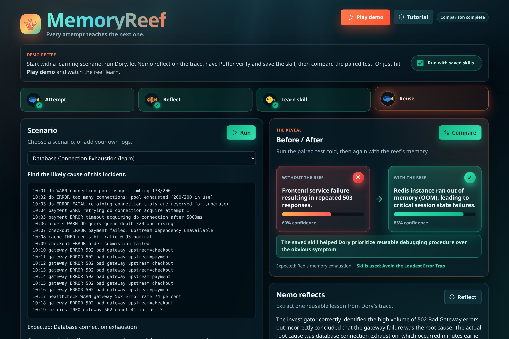

# MemoryReef

### Agents that learn from their mistakes.



Most AI agents are brilliant but forgetful. An agent can spend ten steps discovering the right way to debug a problem, finish the task, and then throw the lesson away. The next run starts from scratch and walks into the same trap again.

**MemoryReef gives an agent procedural memory.** It solves a debugging task, reflects on its own trace, distills a single reusable *lesson*, gates that lesson for quality and safety, and drops it into a growing "reef" of skills. The next time a similar problem shows up, it reuses the lesson and gets the answer right.

The key distinction: MemoryReef stores **habits, not facts**.

| A fact | A lesson (what MemoryReef stores) |
| --- | --- |
| "The service is named `checkout-api`." | "When logs show many repeated errors, build a timeline before choosing a root cause. The loudest error is often just a symptom." |

Facts go stale. A better *habit* makes the agent smarter on every future task.

---

## The result, up front

The three agents are [Google ADK](https://google.github.io/adk-docs/) Agents using Gemini. We ran a controlled experiment across **4 paired debugging scenarios** (learn on one incident, test on a different-but-related one).

| Condition | What it is | Accuracy | Avg. confidence |
| --- | --- | :---: | :---: |
| **Baseline** | Solve the test scenario with no memory | **0%** | 0.56 |
| **Reuse** | Same scenario, after learning the skill | **100%** | 0.80 |
| Random-skill control | Same scenario + an *unrelated* saved skill | 0% | 0.56 |


**0% → 100% accuracy after learning on this small curated benchmark.** In the controlled experiment, Dory solved 0/4 paired test scenarios without memory, 0/4 with an unrelated random skill, and 4/4 when the relevant learned skill was retrieved.

A random saved skill did not help, but the relevant learned lesson did. That suggests the improvement comes from the trace-derived skill. Full numbers live in [`backend/data/paper_summary.md`](backend/data/paper_summary.md).

---

## The loop

```
   ┌────────────────────────────────────────────────────────────────┐
   │                                                                │
   ▼                                                                │
Attempt  ──▶  Trace  ──▶  Reflect  ──▶  Verify  ──▶  Save Skill ────┘
 (Dory)      (stored)     (Nemo)       (Puffer)      (the "reef")
   │                                                       │
   │                    ┌──── retrieve on a similar task ──┘
   ▼                    ▼
 wrong answer,      right answer,
 low confidence     higher confidence
```

1. **Attempt** — Dory investigates an incident and produces a structured answer + evidence.
2. **Trace** — the run is redacted and summarized into a stored trace.
3. **Reflect** — Nemo reads the trace and distills one reusable skill (a "pearl").
4. **Verify** — Puffer gates the skill for usefulness, generality, duplicates, and secrets.
5. **Save** — approved skills enter the reef (the memory library).
6. **Reuse** — on a similar task, Dory retrieves the skill and avoids the old mistake.

---

## Meet the agents

| Agent | Role | What it actually does |
| --- | --- | --- |
| 🐟 **Dory** | Investigator | An `LlmAgent` that names the single most likely root cause + evidence + confidence. Python tools (redact / keyword / timeline) prep the trace and feed the prompt; Gemini makes the call. Smart, but forgetful without the reef. |
| 🐠 **Nemo** | Reflection | An `LlmAgent` that reads Dory's trace and distills **one** reusable, procedural, service-agnostic lesson (a "pearl"). |
| 🐡 **Puffer** | Verifier | An `LlmAgent` that judges usefulness and generality — wrapped in **hard Python safety guards** (secret/PII regex, too-terse, duplicate-tag) that run before the LLM and can never be overruled by it. |

Memory should be a curated notebook, not a junk drawer — Puffer is why.

### Powered by Google ADK

All three characters are genuine `google-adk` `LlmAgent`s defined in [`backend/agents/adk_runtime.py`](backend/agents/adk_runtime.py) (`build_dory` / `build_nemo` / `build_puffer`), each with a persona instruction and a flat **Pydantic `output_schema`** (`DoryOutput` / `NemoOutput` / `PufferOutput`) so every response parses as structured JSON. Every model call flows through a **single seam, `run_agent`**, which makes tests trivial to mock and keeps the whole loop behind one boundary. Design note: the small deterministic tools run in Python and feed the prompt rather than being registered as ADK function-tools, because `output_schema` + `tools` isn't reliably served on current Gemini models — and reliable structured output is what keeps the loop parseable. Puffer additionally keeps its mechanical safety checks in Python (never delegated to the LLM).

---

## The signature demo: the "Loudest Error Trap"

**Learn scenario — a database incident.** The logs end with a wall of gateway errors:

```
10:01 db      ERROR too many connections
10:02 payment ERROR timeout acquiring db connection
10:03 checkout ERROR payment failed
10:04 gateway ERROR 502
10:04 gateway ERROR 502          ← the loudest error (repeats)
10:04 gateway ERROR 502
```

A naive agent trusts the noise and blames the **gateway**. But the timeline says otherwise: the *first* abnormal event is `db too many connections`. The gateway 502s are downstream symptoms. Nemo distills the lesson:

> **Avoid the Loudest Error Trap** — Do not assume the most repeated error is the root cause. Build a timeline, find the earliest abnormal event, and check whether the frequent error came later as a symptom.

Puffer approves it. It enters the reef.

**Test scenario — a *different* incident with the same shape.** Now it's Redis, and the loudest error is a repeated `frontend 503`:

```
11:01 redis    ERROR maxmemory limit reached   ← the real root cause
11:02 api      ERROR connection refused
11:03 frontend ERROR 503                        ← the loudest error (repeats)
11:03 frontend ERROR 503
11:03 frontend ERROR 503
```

- **Without the skill:** Gemini blames the *frontend* (the loudest 503s) — wrong, confidence ≈ 0.60.
- **With the skill:** the retrieved lesson + timeline go into the prompt, and the *same model* answers **Redis maxmemory / cascade failure** — correct, confidence ≈ 0.85.

Same trap, new costume. The agent didn't memorize "Redis" — the learned lesson taught it to *stop trusting the loudest error*, and that habit transferred to a new incident.

---

## Setup

**Prerequisites:** Python 3.12+, [`uv`](https://docs.astral.sh/uv/), Node.js + npm, and access to Gemini via **either** Google AI Studio **or** Vertex AI. The agents make real LLM calls, so a configured `.env` is required.

```bash
# install uv if you don't have it
curl -LsSf https://astral.sh/uv/install.sh | sh
```

Copy the example env file and pick one backend:

```bash
cp .env.example .env
```

Fill in your API Key from Google AI Studio or use a GCP project.

## Quickstart

### Option A — one command, full demo

```bash
uv run memoryreef
```

This dual launcher starts **both** servers (and runs `npm ci`/`npm install` for the frontend the first time if `node_modules/` is missing):

```
Frontend: http://127.0.0.1:5173
Backend:  http://127.0.0.1:8000
```

### Option B — run the services separately

```bash
# backend (FastAPI on :8000)
uv run uvicorn backend.main:app --reload

# frontend (Vite on :5173), in a second terminal
cd frontend
npm install
npm run dev
```

Open **http://127.0.0.1:5173** and walk the loop: run an attempt, reflect, verify, save the skill, then compare with-vs-without on the paired scenario.

### Run the tests

An API-level end-to-end test walks the full loop (`attempt → reflect → verify → save-skill → compare`) against a FastAPI `TestClient`. It mocks the single `run_agent` LLM boundary, so it runs **fully offline in ~1s** — no credentials, no Gemini calls, no token cost — while still exercising all the real endpoints, stores, retrieval, and Puffer's Python safety guards:

```bash
uv run pytest backend/tests/
```

---

## Under the hood

- **Backend:** Python + FastAPI, managed with `uv`. `google-adk` LlmAgents on Gemini, Python tools, and a research harness.
- **Frontend:** React + Vite (talks to the backend directly; CORS-allowed, no proxy).
- **Storage:** local JSON files in `backend/data/` (scenarios, skills, traces, experiment runs).
- **Docs:** [`docs/architecture.md`](docs/architecture.md) — the loop, every agent's tools, the data model, the API surface, and the research harness in detail.

---

> Make an agent learn from its struggles!
